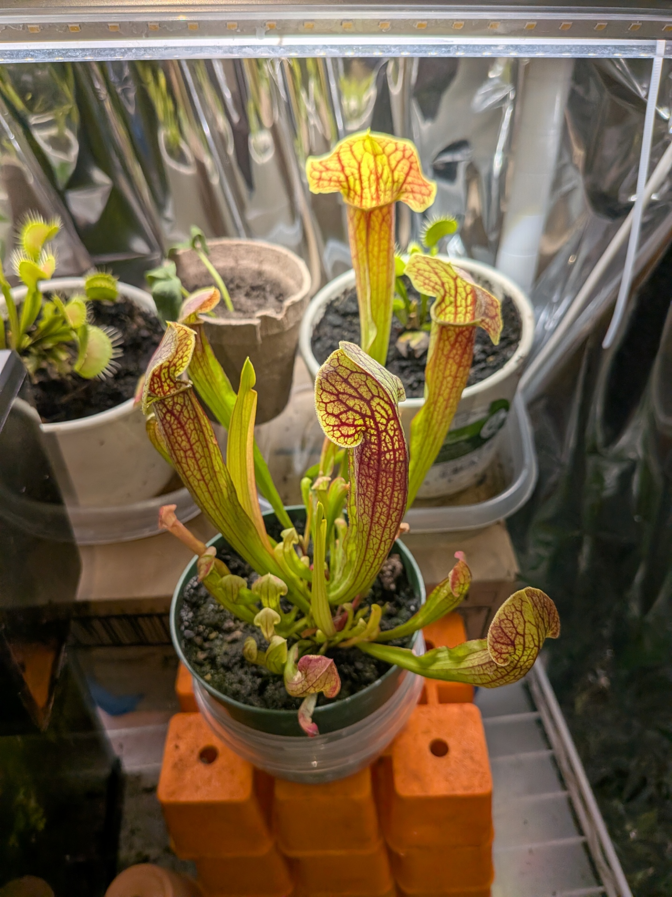
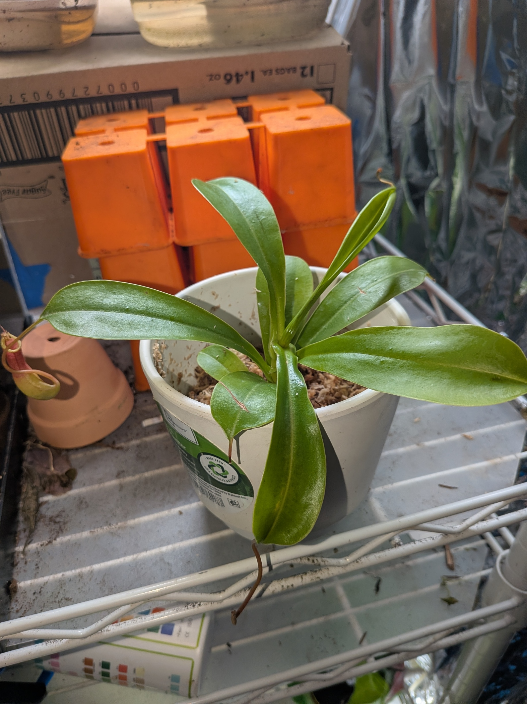
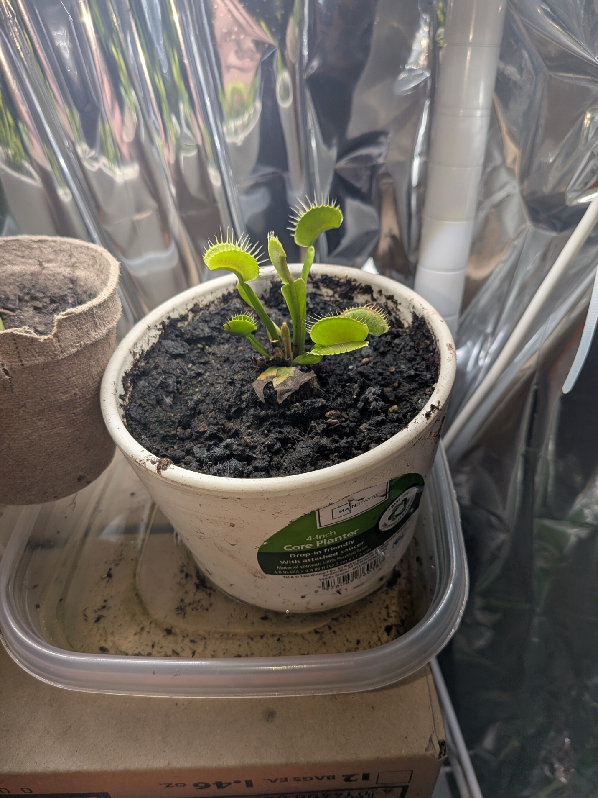
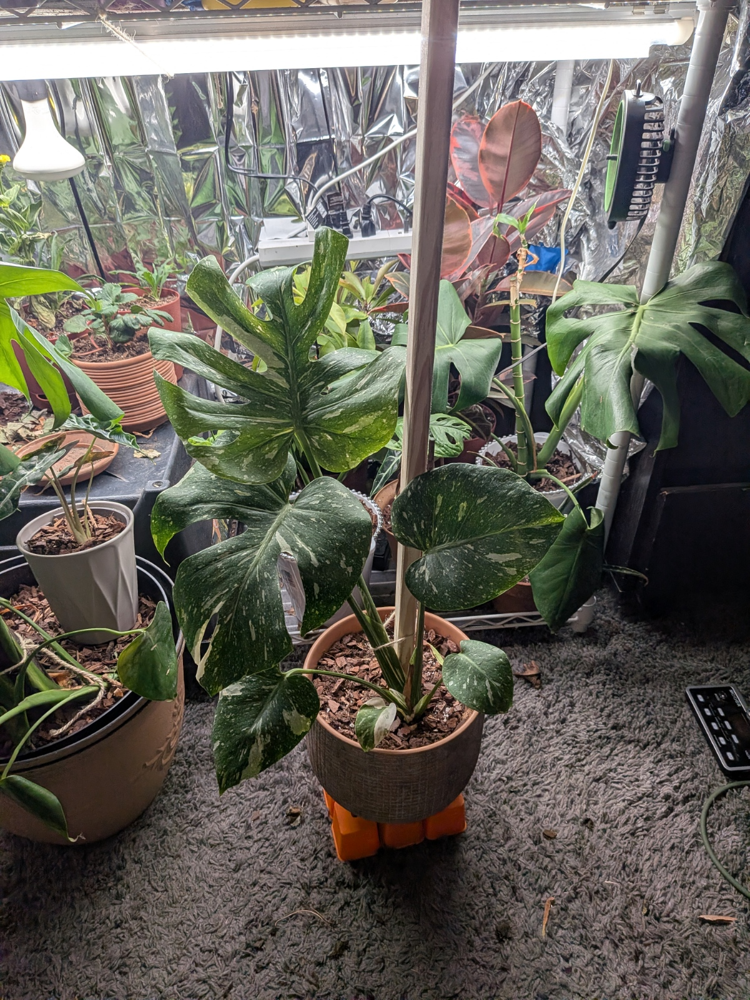
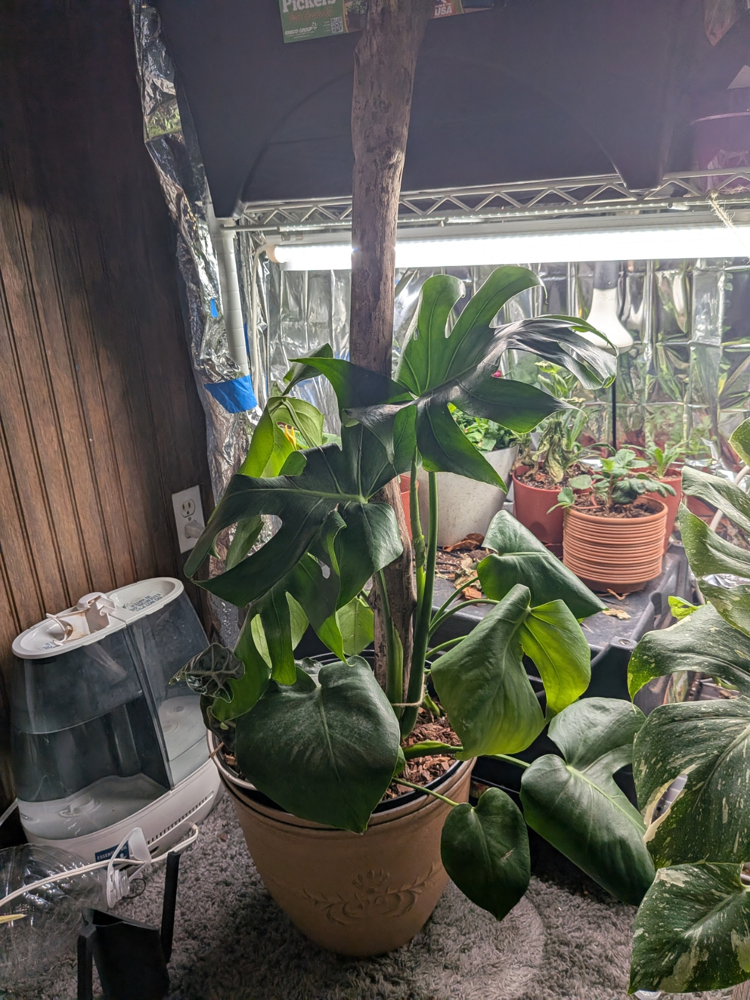
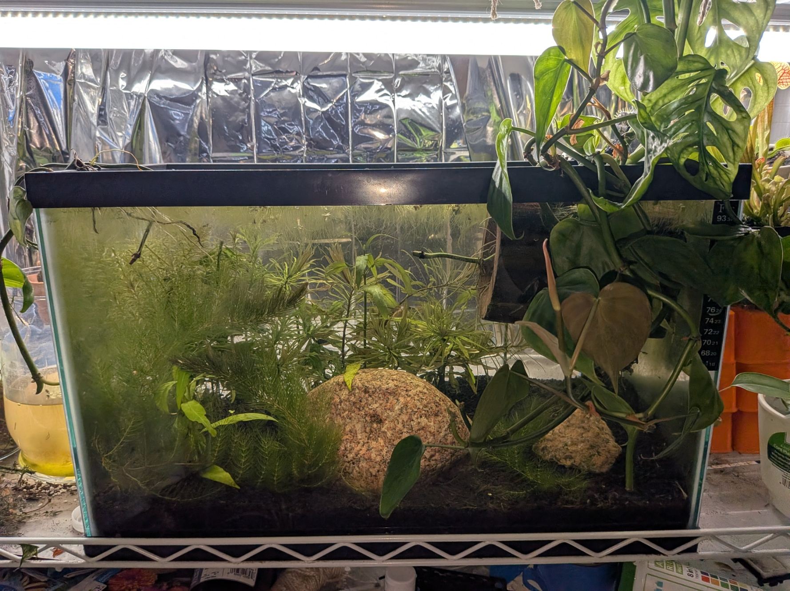

# Indoor_Greenhouse_Moniter
A Linux-based IoT network using ESP32 and Raspberry Pi to monitor aquatic parameters and greenhouse rack microclimates.

## Monitored Environments
Documenting the physical ecosystems currently integrated into the IoT network.

### Carnivorous Plants

Sarracenia / Venus Flytrap

Nepenthes / Tropical Pitcher Plant

Dionaea Muscipula / Bog Pitcher Plant

### Tropical Aroids

Monstera Thai Constellation:

Monstera Deliciosa:

Monstera Adansonii:

### Aquaruim

